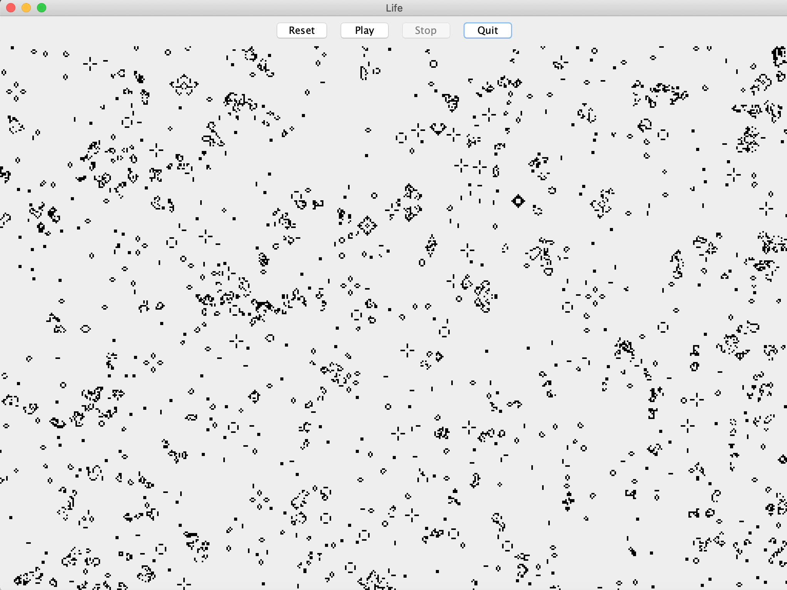

# Life

A modest Java implementation of [Conway's Game of Life](https://en.wikipedia.org/wiki/Conway%27s_Game_of_Life).


## Screenshot



## Objectives

- Prove to mentor that I can code.
- Stick to original rules of Conway's Game of Life
- Experiment with Java multithreading techniques.
- Keep code clean and lean.
- Have fun.


## Contribute

Performance, testing and code cleanup suggestions are encouraged. This is meant to be a learning experiment so please submit PR's if you have any ideas.

### Prerequisites
- JDK 11

### Build

```shell script
./gradlew clean build
```

### Run

```shell script
./gradlew bootRun
```